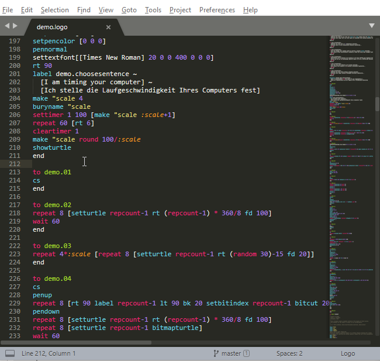

# Syntax Highlighting, Auto Completion and Inline Help for Logo files in SublimeText

A SublimeText package that adds syntax highlighting, auto completion and inline help for Logo files. Inline help provided in English and Croatian. 



## Installation

Download the Logo directory and place it in the Packages/User subdirectory (in SublimeText click on Preferences|Browse Packages...). Then go into the Logo directory and copy either `Logo.sublime-completions_en` or `Logo.sublime-completions_hr` into `Logo.sublime-completions` . This way you choose between English and Croatian inline help. The Croatian help has been Google translated and then programmatically corrected so align your expectations accordingly.  

## Useful SublimeText Links
- [SublimeText - Syntax Definitions](http://www.sublimetext.com/docs/3/syntax.html)
- [SublimeText - Scope Naming](http://www.sublimetext.com/docs/3/scope_naming.html)
- [PackageDev - Syntax Definitions](https://github.com/SublimeText/PackageDev/wiki/Syntax-Definitions)
- [Syntax Development Tips/Advice](https://github.com/sublimehq/Packages/issues/757)

## Useful Logo Links
- Wikipedia [Logo (programming_language)](https://en.wikipedia.org/wiki/Logo_(programming_language))
- Yahoo! [LOGOFORUM](https://groups.yahoo.com/neo/groups/LOGOFORUM/info) newsgroup
- StackOverflow [logo-lang](https://stackoverflow.com/questions/tagged/logo-lang) tagged questions
- [comp.lang.logo](https://groups.google.com/forum/#!forum/comp.lang.logo) newsgroup
- [Logo Foundation](http://el.media.mit.edu/logo-foundation/index.html)
- [Ian Bicking on Logo](http://www.ianbicking.org/blog/2007/10/logo.html)
- [Introduction to Computer Programming](http://guyhaas.com/bfoit/itp/IntroCmds.html)

## Logo Implementations
- [Berkeley Logo (UCBLogo)](https://people.eecs.berkeley.edu/~bh/logo.html)
- Online [Logo Interpreter](https://www.calormen.com/jslogo/)
- [papert―logo in your browser](http://logo.twentygototen.org/_REo_2F2)
- [LibreLogo](http://librelogo.org/en/) is the simple, localized, Logo-like programming environment of LibreOffice with turtle vector graphics for teaching of computing (programming and word processing), DTP and graphic design.
- [FMSLogo](http://fmslogo.sourceforge.net/)

## Remote Application Control
By using [pywinauto](https://pywinauto.github.io/) python package you can control other application running on the same machine. Start with [How to](https://pywinauto.readthedocs.io/en/latest/HowTo.html) document for a description of how to use `pywinauto`.

The following code shows how to control FMSLogo from `python`. See the output of the `dlg.print_control_identifiers()` method [here](./pywinauto_print_control_identifiers_FMSLogo_7.4.0.txt).

```python
from pywinauto.application import Application
# app = Application().start(r"c:\path\to\your\application -a -n -y --arguments")
# app = Application().connect(path=r"c:\path\to\your\application")
# app = Application().connect(title_re=".*FMSLogo", class_name="FMSLogo")
app = Application().start(r"C:/app/dev/FMSLogo/FMSLogo.exe")
app = Application().connect(title_re="FMSLogo")
app.FMSLogo.menu_select("Datoteka->Učitaj")  # Croatian FMSLogo
app.FMSLogo.menu_select("File->Open")   # English FMSLogo
dialogs = app.windows()
dlg = app.top_window()
dlg.print_control_identifiers()
dlg.stcwindow.type_keys('help')
dlg['IzvršiButton'].click()
dlg.stcwindow.type_keys('forward{VK_SPACE}100')
dlg['Button7'].click()
dlg.stcwindow.type_keys('rt{VK_SPACE}90{VK_SPACE}forward{VK_SPACE}50{ENTER}')
dlg.stcwindow.type_keys('rt{ }90{ }forward{ }50{ENTER}')
dlg.stcwindow.set_text('rt 90 forward 50')
dlg.text.draw_outline("red")
dlg.child_window(title="text", class_name="wxWindow").draw_outline("red")
dlg.child_window(title="text", class_name="wxWindow").texts()

# Copy text to clipboard
dlg.text.set_focus()
dlg.text.type_keys('^a^c')
import win32clipboard

# Get the text from the clipboard
win32clipboard.OpenClipboard()
data = win32clipboard.GetClipboardData()
win32clipboard.CloseClipboard()
print data
```

